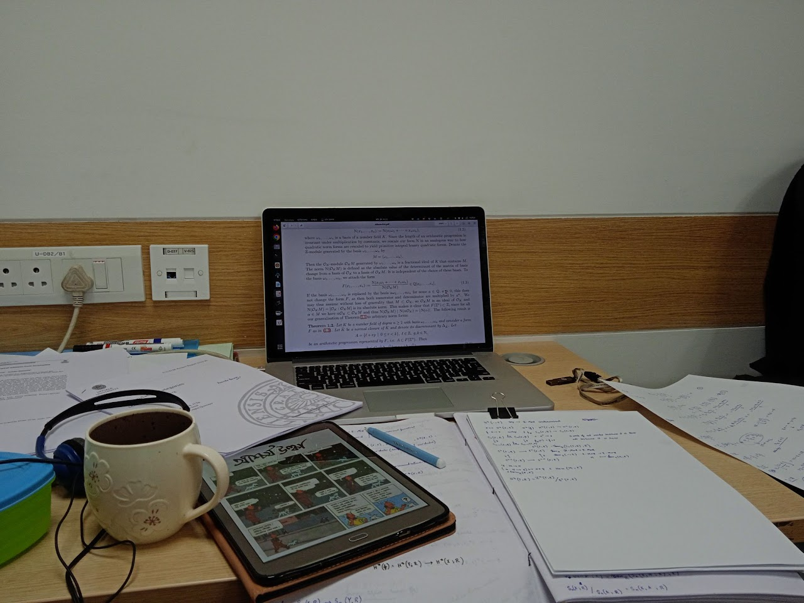

# Anamitro Biswas

M.Sc. in Mathematics (2023) from [National Institute of Technology Silchar](http://maths.nits.ac.in/) (India)

**Thesis advisor:** [Dr. Juthika Mahanta](http://maths.nits.ac.in/juthika/)

**My M.Sc. Thesis:** Coast of a fuzzy set as a ‘crisper’ subset of the boundary [[PDF](https://anamitro.github.io/files/anamitro_thesis.pdf)]

____________________
# Research interest:
Number Theory

**Email:** anamitroappu@gmail.com

____________________
# Papers and pre-prints:

1. Anamitro Biswas and Eshita Mazumdar, _Davenport constant for finite abelian groups with higher rank_, arXiv:2402.09999 [submitted; [preprint](https://arxiv.org/abs/2402.09999)].

2. Anamitro Biswas, Subhankar Jana and Juthika Mahanta, _Application of Coast of a fuzzy set as a crisper synopsis of the fuzzy boundary_ [to appear]

|  |!(blank-white-7sn5o1woonmklx1h.jpg)|
|---------------------|------------------|
|                     |                  |

# Talks:

>> Apr 23rd 2024, *The Davenport Constant for Finite Abelian Groups and its r-wise Generalization*, Students’ Talk at Institute of Advancing Intelligence, TCG Centers of Research and Education in Science and Technology.
>> 
[**Handout**](https://drive.google.com/drive/folders/1lSA4Ks96U_oxGnnNwPm0B6d2ISyrXYmf?usp=drive_link)

>> Feb 4th 2023, *r-wise Davenport constant for finite abelian groups*, COmbinatorial Number Theory And Connected Topics – II (CONTACT-II)

Conference webpage: [https://sites.google.com/view/contact-ii/home](https://sites.google.com/view/contact-ii/home), [**Abstract**](https://drive.google.com/file/d/1OtAvMfGG2xg6Gr6-2gKDHkJ6REjTZkg2/view), [**Handout**](https://drive.google.com/file/d/11k1bXrPQqw_AAf8s9JweYXBvNs6qcWL3/view?pli=1)

______________________
# Besides Mathematics,
I am also interested in

# Painting
[see this other website](https://sites.google.com/view/ani-paint),

# Typography and Sanskrita-Bengali literature.

>> [TeXChand](https://sites.google.com/view/texchand) for Indian vernacular typesetting

>> [chicago1893](https://github.com/anamitro/beamercolortheme-chicago1893), beamer color theme

>> [ibus-table-sasanka](https://sites.google.com/view/sasankadeva), Bengali input in Unix

>> [Taittiriiya](https://taittiriiya.blogspot.com/), my blog

