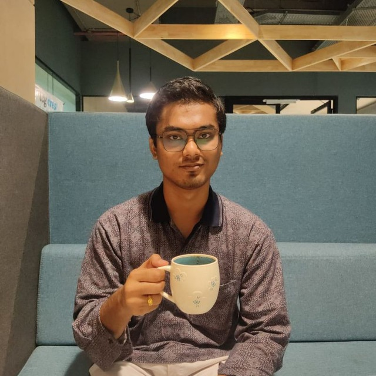
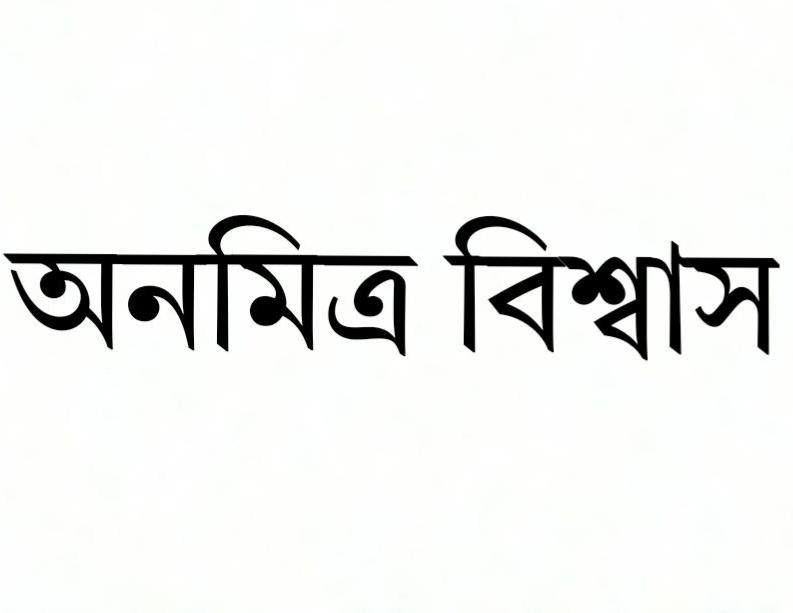
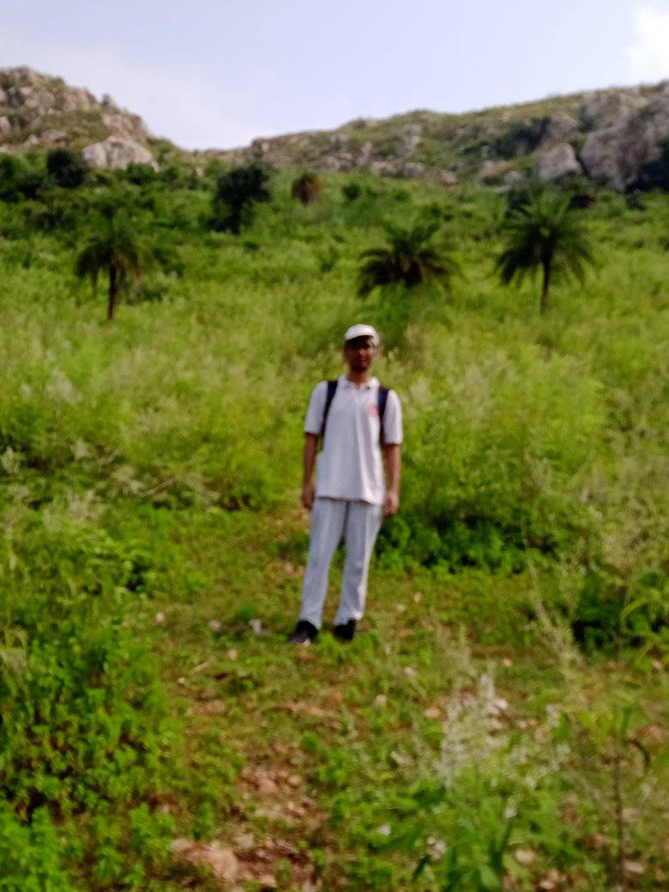

[<kbd>   **Home**   </kbd>](home.md) [<kbd>   **Research**   </kbd>](research.md) [<kbd>   **Talks**   </kbd>](talks.md) [<kbd>   **Other stuff**   </kbd>](hobbies.md) [<kbd>   **see in Bengali**   </kbd>](bn.md)

____

*“God exists since mathematics is consistent...”* André Weil

 

## About me

Research scholar, Department of Mathematics, <a href="https://iitbhilai.ac.in">Indian Institute of Technology Bhilai</a>.
  
During daytime on weekdays, you'll find me in Room no. 313, level 3, SD-2 building in the Academic Block. On weekends, I am generally far from office: at my home in Kolkata or at my friend's Chinmaya's home in Bargarh close by.
  
I have completed M.Sc. in Mathematics from <a href="http://maths.nits.ac.in/">National Institute of Technology Silchar</a> (India). [Dr. Juthika Mahanta](http://maths.nits.ac.in/juthika/) supervised my M.Sc. thesis, titled *Coast of a fuzzy set as a 'crisper' subset of the boundary*. [<kbd>   **M.Sc. Thesis**   </kbd>](files/anamitro_thesis_old.pdf)
  
I can speak Bengali (first language), English, Sanskrit and Hindi. I can understand Oriya, Punjabi and Maithili by listening (can't read, though).
  
Email: anamitroappu@gmail.com
>> or anamitrob@iitbhilai.ac.in, but I prefer the former one.

  
[<kbd>   **CV**   </kbd>](files/anamitro_cv.pdf)

<kbd>on a short trek at Pragbodhi caves (where Lord Buddha stayed for 6 years before His Enlightenment), Oct 2024</kbd>
