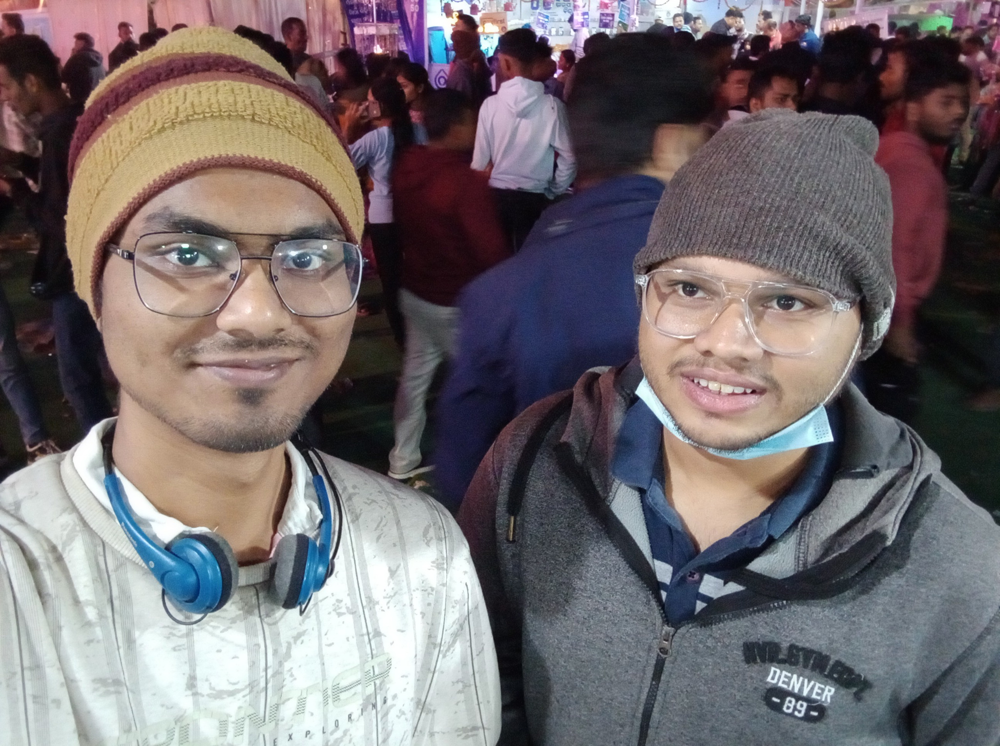

_____

###### With my friend Chinmaya (Jan 2025). Here we were participating in the Dhanuyatra festival, pompously celebrated in western Odisha.

## Fourth MERU 2026
I am part of the team led by Dr. Anurag Singh, hosting <a href="https://events.iitbhilai.ac.in/meru2026">Fourth Meru Combinatorics Conference</a> at IIT Bhilai.

## Math Notes
 [Here](https://anamitro.github.io/notes) are uploaded some notes (on some topics in math) I had made while studying or teaching for my own clarification.

# Besides Mathematics, I am also interested in

## Painting

Apart from mathematics, I have a serious interest in painting. I initially started by learning styles of the Bengal Renaissance School studying books by Abanindranath Tagore and Nandalal Bose, and studying iconography of Indian and East Asian art from various books, most importantly Lady Herringham's compilation of Ajanta mural copies and a Mongolian government publication on Buddhist iconography. Obviously, the styles were adapted with my personal capabilities and inclinations. Some of my paintings are uploaded in [<kbd>   this other website   </kbd>](https://sites.google.com/view/ani-paint).

## Typography

##### ibus-table-sasankadeva [?&color=rgb(255%2C%20153%2C%2051))](https://anamitro.github.io/ibus-table-sasankadeva)
Bengali (and Assamese) input in Unix

##### TeXchand 
for Indic vernacular typesetting and printing

##### chicago1893 [?label=chicago&labelColor=rgb(128%2C%200%2C%200))](https://anamitro.github.io/beamercolortheme-chicago1893)
beamer color theme

## Sanskrita-Bengali literature
>indigo: print and online
>blue: online
>black: print
- Acting, Animé and AI; The Statesman (Perspective) 13/11/2025, p.7 (Kol p.9) 
- মহাকালের চিত্রনাট্যে ক্রমেই বাদ পড়ছে ঋত্বিক ঘটকের স্বপ্ন— নিষ্ফলা যজ্ঞের ঋত্বিক; Robbar.in 08/11/2025 
- সিনেমা দেখে কি ইতিহাস শেখা যায় না? সিনেমা, ইতিহাস, ইতিবৃত্ত; Sangbad Pratidin 18/10/2025, p.4 
- রাজ্য ও তার গান— প্রাসঙ্গিকতা ও চয়নের যথার্থতা; Jaladarchi 13/01/2024 
- ধুলামন্দিরের স্থপতি: রবীন্দ্রনাথ ঠাকুর ও লিওনার্দ এল্ম্‌হার্স্ট; Jaladarchi 09/05/2021 
- একটি বাইসিকল, একটি নদী ও একটি গ্রাম: তরুণ সত্যজিতের প্রেরণারা; Jaladarchi 30/04/2021 

