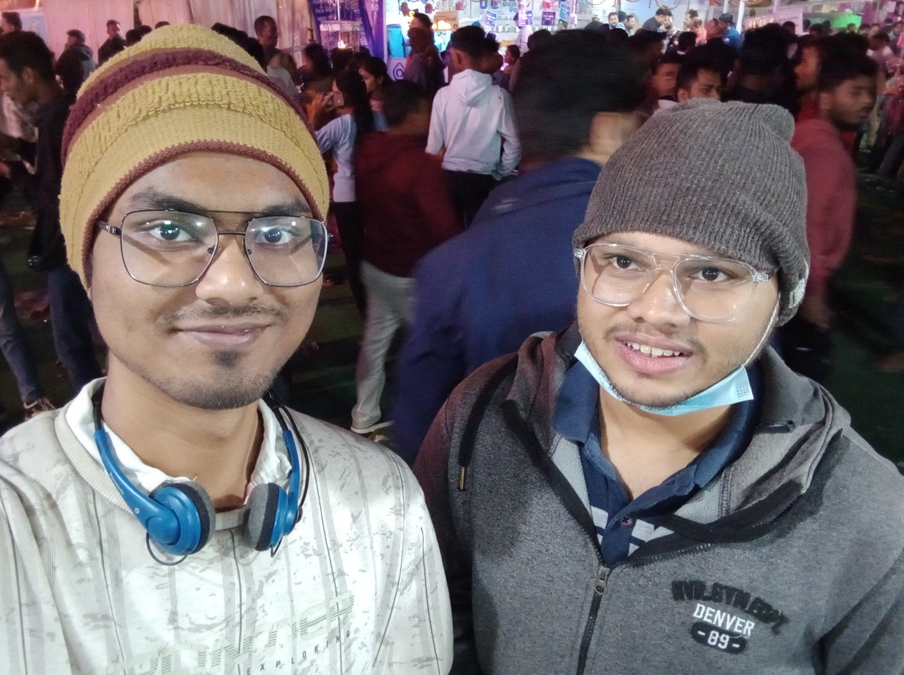

_____

## Painting

This other website showcases a few:

## Math notes

## Typography tools

#### rime-sasanka
Cross-platform Bengali-Assamese input

#### ibus-table-sasankadeva
Bengali-Assamese input in Unix

[?style=for-the-badge&color=rgb(255%2C%20153%2C%2051))](https://anamitro.github.io/ibus-table-sasankadeva)

#### TeXchand
-based Indic scripts typesetting and printing

#### chicago1893

beamer color theme

[?style=for-the-badge&label=chicago&labelColor=rgb(128%2C%200%2C%200))](https://anamitro.github.io/beamercolortheme-chicago1893)

## Social handles

________

###### With my friend Chinmaya (Jan 2025). Here we were participating in the Dhanuyatra festival, pompously celebrated in western Odisha.

