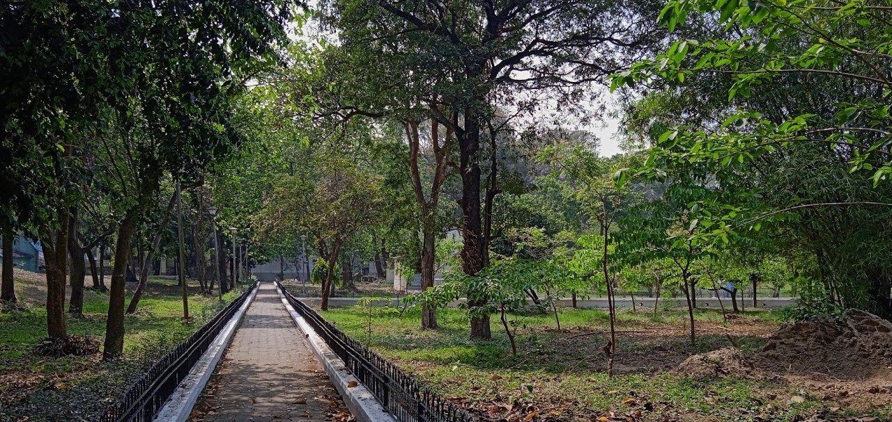
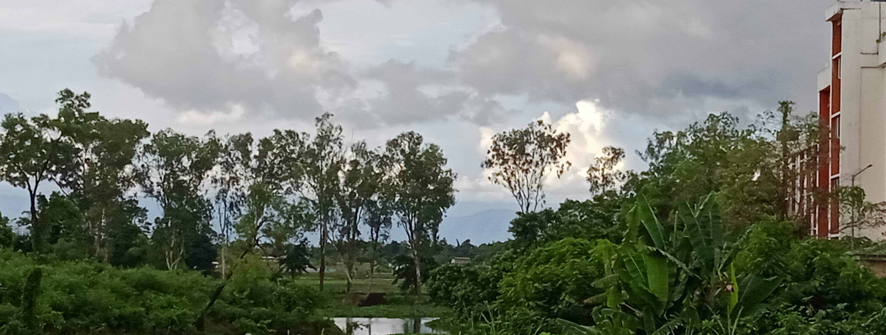

_____

# Research

1. [Affiliation](#affiliation)
2. [Papers](#papers)
3. [Conference proceedings](#conference-proceedings)
4. [Thesis](#thesis)
5. [Talks](#talks)
6. [Community](#community)

## Affiliation
I am a doctoral student in IIT Bhilai. My advisor, [Dr. Anurag Singh](https://sites.google.com/site/anuragshomepage/). I like to work on Algebraic Topology.
  
I have completed M.Sc. in Mathematics from <a href="http://maths.nits.ac.in/">National Institute of Technology Silchar</a> (India). [Dr. Juthika Mahanta](https://maths.nits.ac.in/faculties/juthika-mahanta), my thesis supervisor.

## Papers

  
  

    Papers
  

  

    National Library Kolkata
  

- Anamitro Biswas and Eshita Mazumdar, _Davenport constant for finite abelian groups with higher rank_, Mathematical Notes, vol. 118, pp. 23-34 (2025)  
> **Add-on:** Proposed bounds for D_r can be calculated for groups up to rank 3, and cycle lengths having at most 3 prime factors, using [this R program](https://github.com/anamitro/d-r-bounds).

## Conference proceedings

- Anamitro Biswas (joint work with Subhankar Jana and Juthika Mahanta), *A Crisper Alternative to the Fuzzy Boundary* (extended abstract), Proceedings of IMBIC: 18th International Conference on MSAST 2025, vol. 14, ISBN: 978-81-981948-5-5  
- Anamitro Biswas (joint work with Eshita Mazumdar), *Aspects of the Davenport Constant for Finite Abelian Groups* (extended abstract), Proceedings of IMBIC: 18th International Conference on MSAST 2024, vol. 13, ISBN: 978-81-981948-0-0. 

## Thesis

- Anamitro Biswas, *Coast of a fuzzy set as a 'crisper' subset of the boundary*, under the supervision of Dr. Juthika Mahanta, National Institute of Technology Silchar (2023). 
> thesis submitted in partial fulfillment of the requirements for the Project of the Master degree work

## Talks

  
  

    Talks
  

     

    NIT Silchar campus
  

### 2025

- Dec 23rd, *A Crisper Alternative to the Fuzzy Boundary*, [19th International Conference: Mathematical Sciences for Advancement of Science and Technology (MSAST 2025), organized by IMBIC](https://imbicorg.blogspot.com/)  

### 2024

- Dec 21st-23rd, *Aspects of the Davenport Constant for Finite Abelian Groups*, [18th International Conference: Mathematical Sciences for Advancement of Science and Technology (MSAST 2024), organized by IMBIC](https://imbicorg.blogspot.com/)  
- Apr 23rd,*The Davenport Constant for Finite Abelian Groups and its r-wise Generalization*, [Students’ Talk at Institute of Advancing Intelligence, TCG Centers of Research and Education in Science and Technology](https://www.tcgcrest.org/research-seminars/) 

### 2023

- Feb 4th, *r-wise Davenport constant for finite abelian groups*, [COmbinatorial Number Theory And Connected Topics – II (CONTACT-II)](https://sites.google.com/view/contact-ii/home)  

## Community

