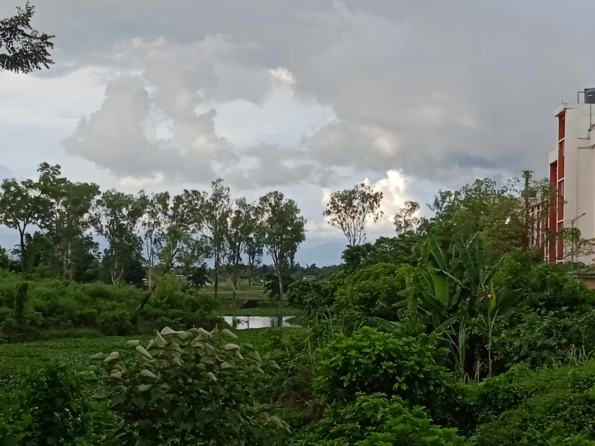

<link rel="stylesheet" href="https://fonts.googleapis.com/css2?family=Material+Symbols+Outlined:opsz,wght,FILL,GRAD@24,400,0,0&icon_names=book" />

_____

# Talks

###### the campus of NIT Silchar, where I did my M.Sc.

# 2024

- Dec 21st-23rd,*Aspects of the Davenport Constant for Finite Abelian Groups*, [18th International Conference: Mathematical Sciences for Advancement of Science and Technology (MSAST 2024) 2024, organized by IMBIC](https://imbicorg.blogspot.com/) [<kbd>   Handout   </kbd>](files/anamitro_msast24.pdf) 
- Apr 23rd,*The Davenport Constant for Finite Abelian Groups and its r-wise Generalization*, Students’ Talk at Institute of Advancing Intelligence, TCG Centers of Research and Education in Science and Technology [<kbd>   Handout   </kbd>](https://drive.google.com/drive/folders/1lSA4Ks96U_oxGnnNwPm0B6d2ISyrXYmf?usp=drive_link)

# 2023

- Feb 4th, *r-wise Davenport constant for finite abelian groups*, [COmbinatorial Number Theory And Connected Topics – II (CONTACT-II)](https://sites.google.com/view/contact-ii/home)
[<kbd>   Abstract   </kbd>](https://drive.google.com/file/d/1OtAvMfGG2xg6Gr6-2gKDHkJ6REjTZkg2/view) [<kbd>   Handout   </kbd>](https://drive.google.com/file/d/11k1bXrPQqw_AAf8s9JweYXBvNs6qcWL3/view?pli=1)
